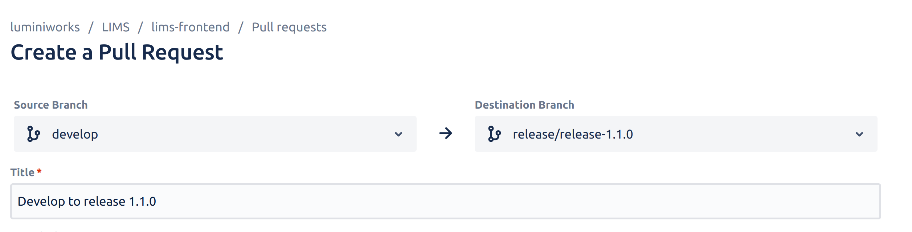

## How to create release
1) Create release branch from master with release version number, like: release/release-1.2.0

2) Create Pull request from dev to release branch

3) Wait until pipeline finish all jobs
4) Checkout on release branch
5) Do rebase on develop


6) Pull request will close by Bitbucket. Its okay.
7) Wait until pipeline finish all jobs [Pipelines on Bitbucket](https://bitbucket.org/luminiworks/lims-frontend/pipelines/results/page/1)
8) Create new pull request from release to master ```DONT DELETE RELEASE BRANCH!!!```
   
9) Wait until pipeline finish all jobs
10) Checkout on master branch
11) Do rebase on release branch
12) Pull request will close by Bitbucket.
13) Go to Jenkins and wait until build finish [Jenkins](https://jenkins.luminiworks.com/view/enverlims-prod/job/prod-front-enverlims/)
14) Wait 5-10 mins. Code base should be delivered to host.
15) Recheck on https://enverlims.com that everything okay

## How to revert release
1) Create pull request from last release to master
2) Wait until pipeline finish all jobs
3) Checkout on master branch
4) Do rebase on release branch

## After success release
1) Ask PM to create new task for front-end to update dependencies on project
2) install ```ncu``` package
3) run ```ncu``` into project folder. I will get list of new versions of deps
4) Update all dependencies instead of: 
   1) nextjs; 
   2) query-string;
